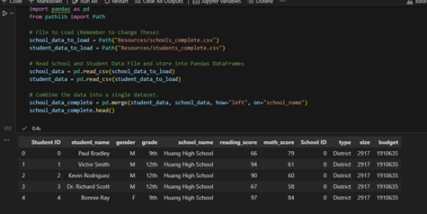
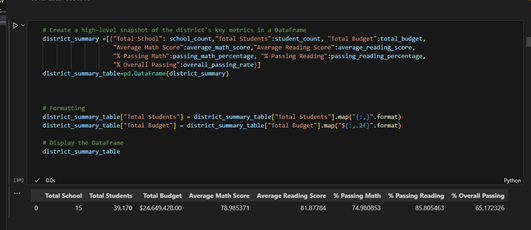
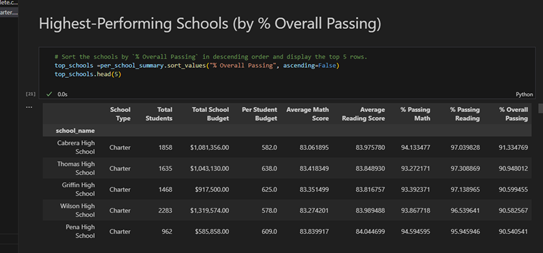
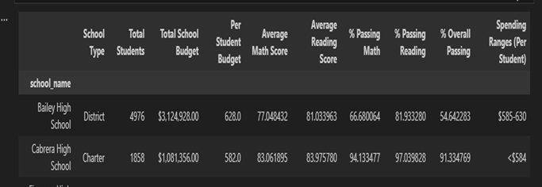
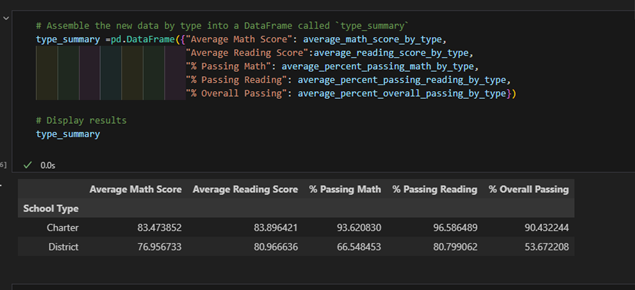

# pandas-challenge
This repository offers a python pandas solution in the education sector to analyze city's school district data. 
This project will help school board to make strategic decisions regarding future school budgets and priorities. 

This project used two datasets in csv format, one is schools_complete.csv file wich includes; in columns Student ID,school_name,type,size,budget. The other dataset is students_complete.csv file which include; in columns Student ID,student_name,gender,grade,school_name,reading_scoreand math_score. For these analysis both datasets imported, merged, and the aggregate data diplayed in to python pandas dataframes.

The project is conducted in Jupyter notebook to showcase, and communicate the analysis report the following link is created: Jupyter Notebook Viewer

Conclusions from the data set:

The dataset shows a total of 15 schools, 39,170 students. The total students average reading score is 81.87 which is higher than the average math score 78.98. When we see the passing rate reading (85.80%) has a higher rate than math (74.98 % ),the overall passing rate is 65.17%. Thus indicating that student's score more in reading than math.

Sorting our data by Schools; shows that Charter schools to be performing better than district schools

Regarding budget per student, Huang High School ( $655.000) has a higher budget per student, and Wilson High School ($578.00) allocates a lower budget per student. 
Huang High School is one of the bottom performing school the same as Bailey High School which has a total of $3M total School budget and has a low overall passing.54%, compared to Carbera High scholl with $1m school budget and an overall passing of 91%.

 The findings from the data showed that in all metrics (average, percent, and overall) of reading and math scores Charter schools have a greater score than District schools

